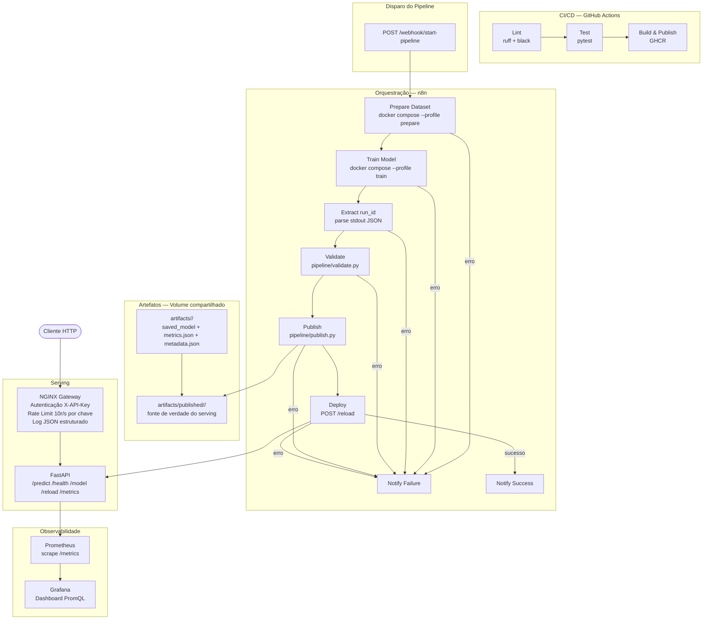

# Diagrama de Arquitetura — MLOps Challenge

Visualização do fluxo end-to-end do sistema, desde o disparo do pipeline até o serving do modelo em produção.

---

## Fluxo end-to-end



---

## Serviços Docker Compose

| Serviço | Imagem | Função |
|---|---|---|
| `api` | `Dockerfile` | FastAPI — serving do modelo |
| `gateway` | `nginx:alpine` | NGINX — controle de acesso |
| `n8n` | `n8n/Dockerfile` (custom) | Orquestrador do pipeline |
| `prometheus` | `prom/prometheus` | Coleta de métricas |
| `grafana` | `grafana/grafana` | Visualização de métricas |
| `prepare` *(profile)* | `Dockerfile` | Executa `ml/prepare_dataset.py` |
| `train` *(profile)* | `Dockerfile` | Executa `ml/train.py` |

---

## Pipeline ML — etapas e contratos

```
Webhook
  │  parâmetros: epochs, batch_size, threshold, train_records, val_records
  ▼
Prepare Dataset
  │  saída: data/processed/ (TFRecords + prepared_dataset.json)
  ▼
Train Model
  │  saída: artifacts/<run_id>/ (saved_model + metrics.json + metadata.json)
  │  stdout (última linha): JSON com run_id, status, metric_value
  ▼
Extract run_id
  │  lê stdout do treino, propaga run_id, threshold, git_sha para etapas seguintes
  ▼
Validate
  │  lê artifacts/<run_id>/metrics.json
  │  exit 0 se val_token_accuracy >= threshold, exit 1 caso contrário
  │  (exit 1 → Notify Failure, pipeline interrompido)
  ▼
Publish
  │  copia artifacts/<run_id>/ → artifacts/published/<run_id>/
  │  grava metadata.json com provenance (git_sha, published_at, métricas)
  ▼
Deploy
     POST http://api:8000/reload { run_id }
     API carrega artifacts/published/<run_id>/saved_model
```

---

## Controle de acesso — Gateway

```
Cliente
  │
  ├─ sem X-API-Key header  →  401 Unauthorized
  ├─ chave inválida         →  403 Forbidden
  ├─ acima do rate limit    →  429 Too Many Requests
  └─ chave válida           →  proxy para API (máx 10 req/s, burst 20)
                                  X-Request-ID propagado para correlação
```

---

## CI/CD — GitHub Actions

```
push / pull_request
  │
  ├─ Lint    ruff check + black --check
  ├─ Test    pytest tests/
  └─ Build   docker build + push para GHCR  (somente push em main)
```
